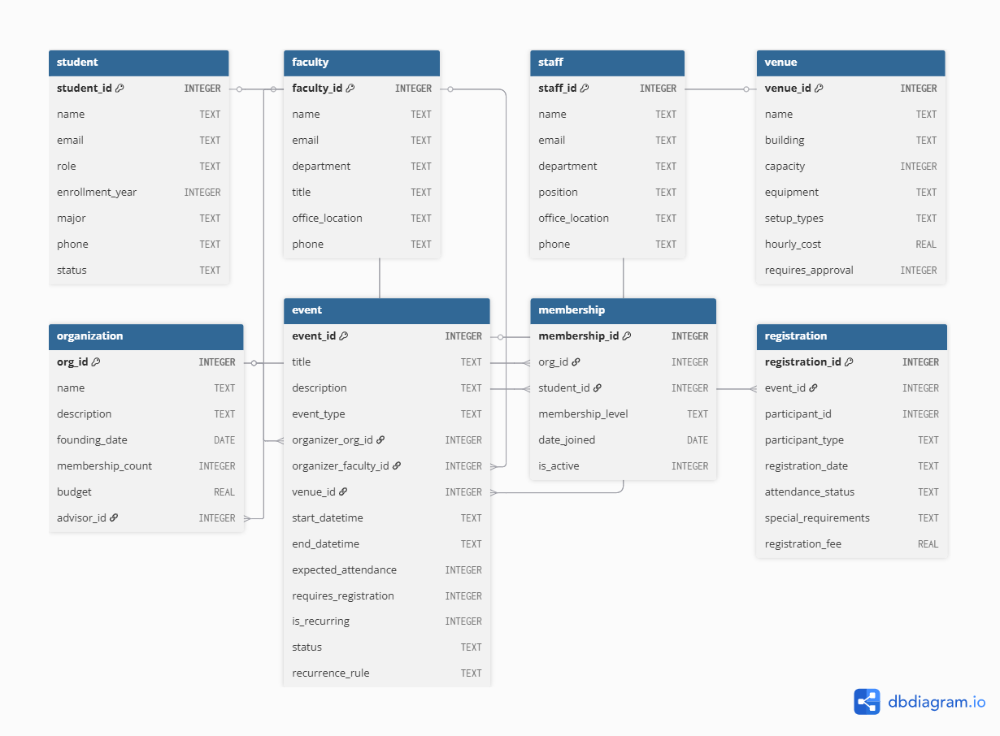

# Campus-Event-Database
SQLite database system to manage university events, venues, organizations, and registrations — built for a Systems Analysis course.

# 🗄️ Campus Event Management System

A fully normalized relational database designed to manage university events, student organizations, venues, and registrations — built with SQLite as part of a Systems Analysis and Design course at Brescia University.

## 📸 ERD



## 🚀 Features

- Manages students, faculty, staff, organizations, venues, events, memberships, and registrations
- Enforces business rules directly in the schema using constraints and triggers
- Prevents double-booking of venues using time-overlap queries
- Global email uniqueness enforced across student, faculty, and staff tables via triggers
- `membership_count` in Organization auto-maintained by insert/update/delete triggers
- Indexed for fast lookups on email and event scheduling
- Includes realistic sample data and test queries
- Python explorer script with multiple query functions

## 🛠️ Built With

- **SQLite** — relational database engine
- **SQL** — schema design, constraints, triggers, indexes
- **Python** — database exploration script

## 📁 Project Structure

```
├── create_schema.sql     # Creates all tables, constraints, triggers, and indexes
├── sample_data.sql       # Populates the database with realistic sample data
├── test_queries.sql      # Example queries to test and explore the database
├── explore_database.py   # Python script to query the database interactively
├── business_rules.md     # Documentation of all business rules and constraints
├── data_dictionary.md    # Description of all tables and columns
└── ERD.png               # Entity-Relationship Diagram
```

## ▶️ How to Run

1. Clone the repository:
   ```bash
   git clone https://github.com/VelosoMiguel/campus-event-database.git
   cd campus-event-database
   ```

2. Create the database and schema:
   ```bash
   sqlite3 campus_events.db < create_schema.sql
   ```

3. Load sample data:
   ```bash
   sqlite3 campus_events.db < sample_data.sql
   ```

4. Run test queries:
   ```bash
   sqlite3 campus_events.db < test_queries.sql
   ```

5. Or explore with Python:
   ```bash
   python explore_database.py
   ```

## 🗂️ Database Schema

| Table | Description |
|-------|-------------|
| `student` | Undergraduate, graduate, and doctoral students |
| `faculty` | Faculty members who advise organizations |
| `staff` | University staff who can organize events |
| `organization` | Student organizations with faculty advisors |
| `venue` | Campus venues with capacity and booking rules |
| `event` | Events with scheduling, type, and status tracking |
| `membership` | Student memberships in organizations |
| `registration` | Event registrations with attendance tracking |

## 🔮 Future Improvements

- [ ] Web interface for event browsing and registration
- [ ] Email notification system for event reminders
- [ ] Analytics dashboard for attendance and venue usage
- [ ] Unified `person` table to simplify polymorphic registration

## 👤 Author

**Miguel Veloso**  
[GitHub](https://github.com/VelosoMiguel) · [LinkedIn](https://www.linkedin.com/in/miguel-veloso-91355b372/)
