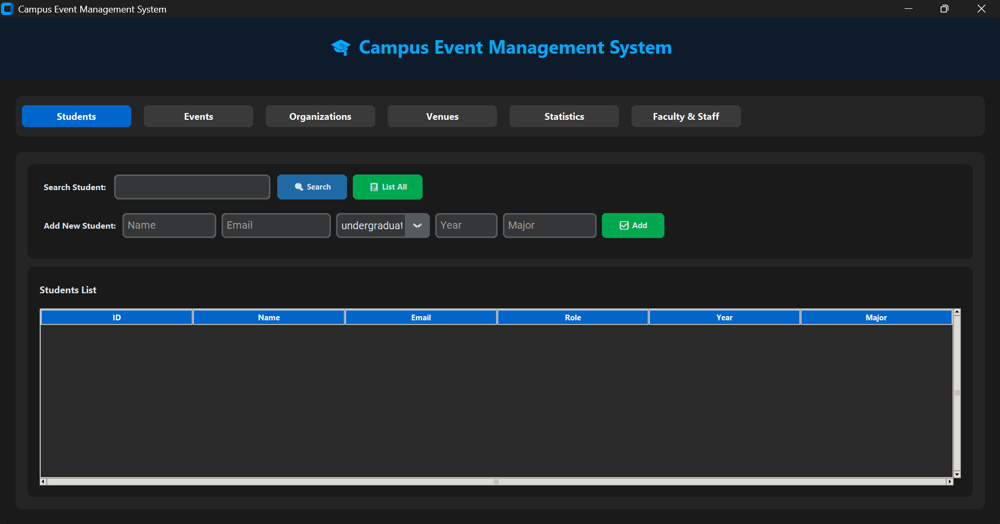
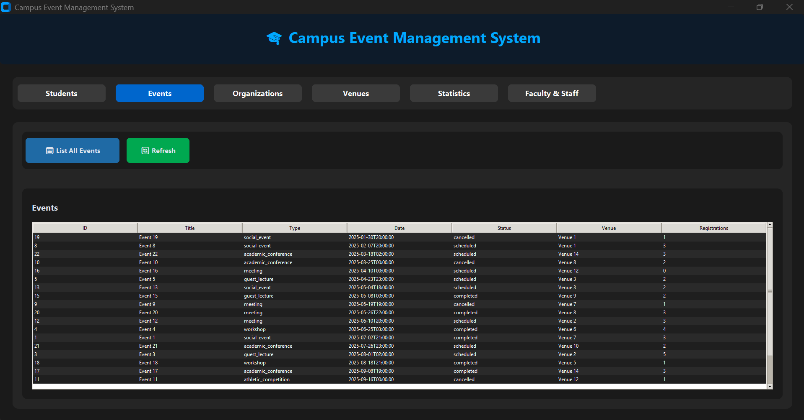
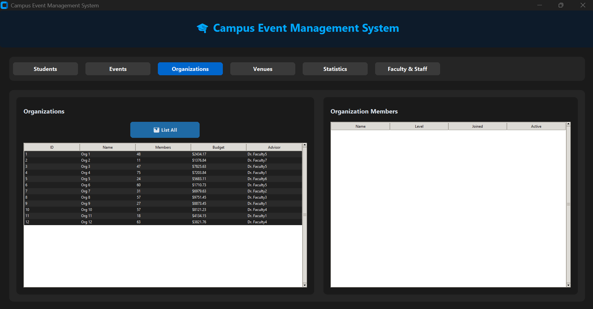
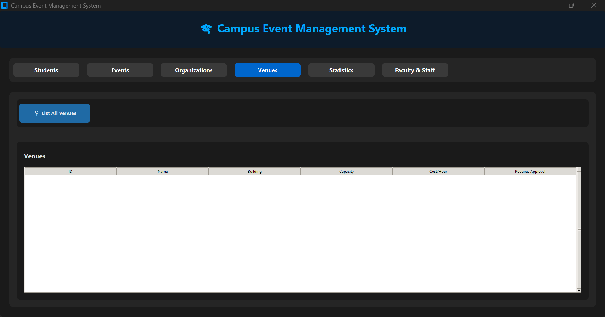
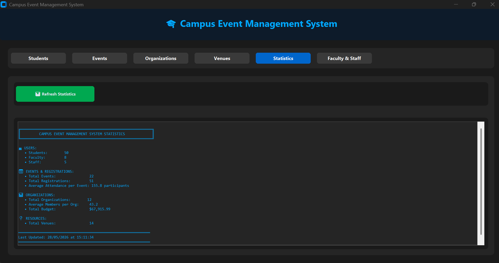
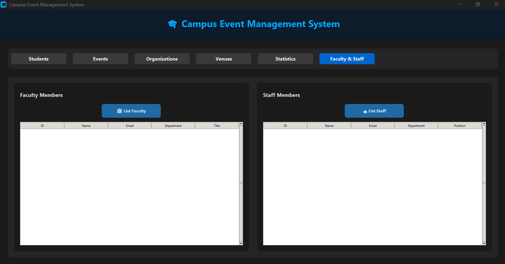

# 🗄️ Campus Event Management System

A fully normalized relational database designed to manage university events, student organizations, venues, and registrations — built with SQLite as part of a Systems Analysis and Design course at Brescia University.

---

## 📸 ERD

### Entity-Relationship Diagram


### 📸 Interactive Desktop App

| Tab | Screenshot |
|---|---|
| **Students** — search, add, and list students by name, email, role, and major |  |
| **Events** — browse events with venue, type, status, and registration count |  |
| **Organizations** — list organizations and view their active members side by side |  |
| **Venues** — browse venues with capacity and approval requirements |  |
| **Statistics** — live dashboard with totals for users, events, organizations, and venues |  |
| **Faculty & Staff** — list faculty advisors and staff members side by side |  |

> Built with Python and Tkinter, the app connects directly to `campus_events.db` and reflects changes in real time — no SQL required.

---

## 🚀 Features

- Manages students, faculty, staff, organizations, venues, events, memberships, and registrations
- Enforces business rules directly in the schema using constraints and triggers
- Prevents double-booking of venues using time-overlap queries
- Global email uniqueness enforced across student, faculty, and staff tables via triggers
- `membership_count` in Organization auto-maintained by insert/update/delete triggers
- Indexed for fast lookups on email and event scheduling
- Includes realistic sample data and test queries
- Interactive desktop GUI app for full database management
- Python explorer script with multiple query functions for terminal-based exploration

---

## 🖥️ Interactive App (`interactive_app.py`)

A desktop application built with **Python + Tkinter** that provides a graphical interface to interact with the database.

**Tabs available:**
| Tab | What you can do |
|---|---|
| Students | Search, add, and list students by name, email, role, and major |
| Events | Browse events with venue, type, status, and attendance info |
| Organizations | View organizations and their faculty advisors |
| Venues | Browse venues with capacity and booking requirements |
| Statistics | View registration summaries and attendance analytics |
| Faculty & Staff | Manage faculty advisors and staff event organizers |

**To launch:**
```bash
python interactive_app.py
```

---

## 🔍 Database Explorer (`explore_database.py`)

A terminal-based Python script for quickly querying and exploring the database without a GUI. Useful for testing, debugging, or scripted reporting.

**Functions available:**

| Function | Description |
|---|---|
| `show_students(limit)` | Lists students with ID, name, email, role, and major |
| `show_events(limit)` | Shows events joined with venue name, type, status, and start time |
| `show_venue_availability(venue_id, start, end)` | Checks if a venue has conflicts in a given time window |
| `show_registration_summary(limit)` | Ranks events by number of registrations |
| `show_org_members(org_id)` | Lists active members of an organization with level and join date |

**Example output:**
```
=== Campus Event Management System Explorer ===

ID    Name                      Email                               Role            Major
------------------------------------------------------------------------------------------
1     Alice Johnson             alice.j@brescia.edu                 undergraduate   Computer Science
2     Marcus Lee                marcus.l@brescia.edu                graduate        Data Analytics
...

✅ Venue 3 is available from 2025-06-01 10:00 to 2025-06-01 14:00
```

**To run:**
```bash
python explore_database.py
```

---

## 🛠️ Built With

- **SQLite** — relational database engine
- **SQL** — schema design, constraints, triggers, indexes
- **Python** — interactive GUI app and database explorer script
- **Tkinter** — desktop GUI framework

---

## 📁 Project Structure

```
├── campus_events.db        # SQLite database file with sample data
├── create_schema.sql       # Creates all tables, constraints, triggers, and indexes
├── sample_data.sql         # Populates the database with realistic sample data
├── test_queries.sql        # Example queries to test and explore the database
├── interactive_app.py      # Desktop GUI app for full database management
├── explore_database.py     # Python script to query the database interactively
├── business_rules.md       # Documentation of all business rules and constraints
├── data_dictionary.md      # Description of all tables and columns
└── ERD.png                 # Entity-Relationship Diagram
```

---

## ▶️ How to Run

**Clone the repository:**
```bash
git clone https://github.com/VelosoMiguel/campus-event-database.git
cd campus-event-database
```

**Create the database and schema:**
```bash
sqlite3 campus_events.db < create_schema.sql
```

**Load sample data:**
```bash
sqlite3 campus_events.db < sample_data.sql
```

**Run test queries:**
```bash
sqlite3 campus_events.db < test_queries.sql
```

**Launch the interactive app:**
```bash
python interactive_app.py
```

**Or explore with Python:**
```bash
python explore_database.py
```

---

## 🗂️ Database Schema

| Table | Description |
|---|---|
| `student` | Undergraduate, graduate, and doctoral students |
| `faculty` | Faculty members who advise organizations |
| `staff` | University staff who can organize events |
| `organization` | Student organizations with faculty advisors |
| `venue` | Campus venues with capacity and booking rules |
| `event` | Events with scheduling, type, and status tracking |
| `membership` | Student memberships in organizations |
| `registration` | Event registrations with attendance tracking |

---

## 🔮 Future Improvements

- [ ] Web interface for event browsing and registration
- [ ] Email notification system for event reminders
- [ ] Analytics dashboard for attendance and venue usage
- [ ] Unified person table to simplify polymorphic registration

---

## 👤 Author

**Miguel Veloso**  
[GitHub](https://github.com/VelosoMiguel) · [LinkedIn](#)
